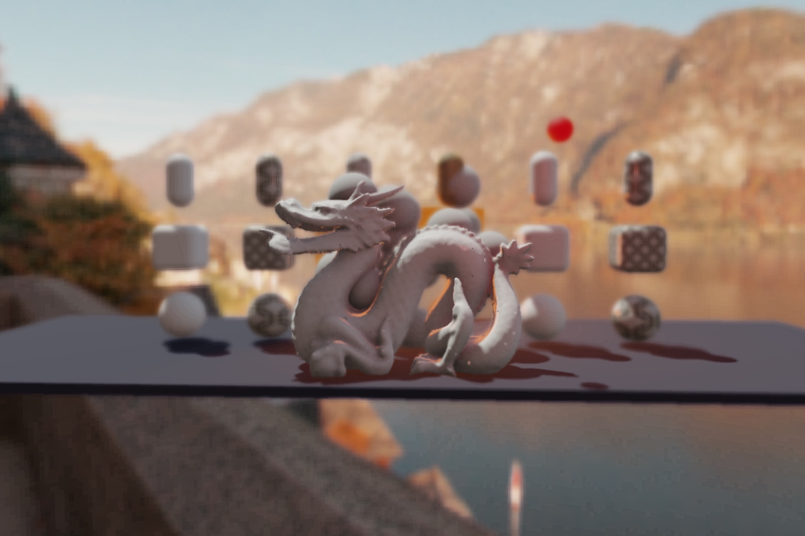

# pex-renderer v3



Physically based renderer (PBR) and scene graph for [PEX](http://pex.gl).

This is an **experimental** API and it's likely to change in the future.

#### Key dependencies:
- [pex-context](http://github.com/pex-gl/pex-context) modern WebGL wrapper (buffers, textures, pipelines, commands etc)
- [pex-math](http://github.com/pex-gl/pex-math) array based math (vec3, mat4, quat etc)

# Contents
- [Usage](#usage)
- [Examples](#examples)
- [API](#api)
  - [Renderer](#renderer)
  - [Entities](#entities)
  - [Components](#components)
  - [Scene Components](#scene-components)
    - transform, camera, postProcessing, overlay
  - [Geometry Components](#geometry-components)
    - animation, geometry, material, morph, skin
  - [Lighting Components](#lighting-components)
    - ambientLight, directionalLight, areaLight, spotLight, skybox, reflectionProbe
  - [Creating Custom Components](#creating-custom-components)

# Usage

PEX Renderer v3 is currently in beta. You can install the latest version via [npm](http://npmjs.com):

```sh
npm i pex-renderer@next
```

This will install v3 with the beta release number after the dash e.g. pex-renderer@3.0.0-4.

PEX Renderer is a CommonJS module and you will need a bundler (e.g. [Browserify](http://browserify.org)) to run it in the browser.

# Examples

```javascript
const createContext = require('pex-context')
const createRenderer = require('pex-renderer')
const createSphere = require('primitive-sphere')

const ctx = createContext({ width: 800, height: 600 })

const renderer = createRenderer({
  ctx: ctx
})

const camera = renderer.entity([
  renderer.transform({ position: [0, 0, 3] }),
  renderer.camera({
    fov: Math.PI / 2,
    aspect: ctx.gl.drawingBufferWidth / ctx.gl.drawingBufferHeight,
    near: 0.1,
    far: 100
  })
])
renderer.add(camera)

const cube = renderer.entity([
  renderer.transform({ position: [0, 0, 0] }),
  renderer.geometry(createSphere(1)),
  renderer.material({
    baseColor: [1, 0, 0, 1]
  })
])
renderer.add(cube)

const skybox = renderer.entity([
  renderer.skybox({
    sunPosition: [1, 1, 1]
  })
])
renderer.add(skybox)

const reflectionProbe = renderer.entity([
  renderer.reflectionProbe()
])
renderer.add(reflectionProbe)

ctx.frame(() => {
  renderer.draw()
})
```

You can find runnable examples in the `/examples` folder in this repository. To run an example install [Node.js](http://nodejs.org), clone or download this repository and then.

```sh
# go to the example folder
cd examples

# install examples dependencies
npm i

# run the example in your default browser window
npx budo example-name.js --open --start
```

# API

## Renderer

Main class responsible for managing scene hierarchy and rendering.
You add your entities to the renderer and call draw every frame.

*Note: PEX Renderer doesn't currently have a concept of a scene. This can be simulated by creating multiple root entities with their own scene hierarchies and adding / removing them as necessary.*

#### renderer = createRenderer(opts)

<!-- eslint-disable no-unused-vars -->
```javascript
const createRenderer = require('pex-renderer')
const renderer = createRenderer({
  ctx,
  shadowQuality: 2,
  rgbm: false,
  profile: false,
  pauseOnBlur: true
})
```

- renderer.paused
- renderer.profiler


| property | info | type | default |
| -------- | ---- | ---- | ------- |
| `ctx` | rendering context | pex-context.Context | null |
| `shadowQuality` | shadow smoothness | Integer 0-4 | 2 |
| `rgbm` | use RGBM color packing for rendering pipeline | Boolean | false |
| `profile` | enable profiling | Boolean | false |
| `pauseOnBlur` | stop rendering when window looses focus | Boolean | false |
| `entities`* | list of entities in the scene | Array of Entity | [] |

&nbsp;* required
&nbsp;* read only

#### renderer.draw()

```javascript
function frame () {
  renderer.draw()
  requestAnimationFrame(frame)
}

requestAnimationFrame(frame)

// or using built-in frame() from pex-context
ctx.frame(() => {
  renderer.draw()
})
```

Updates transforms, shadow-maps, reflection probes, materials, shaders, renders the scene and applies post-processing. Should be called every frame.

## Entities

Entities are collection of [components](#components) representing an object in the scene graph.

*NOTE: It's worth mentioning that in its current form PEX Renderer doesn't implement [Entity-Component-System](https://en.wikipedia.org/wiki/Entity–component–system) architecture.* Components are self contained and fully functional not merely buckets of data to be processed by a collection of systems. In that regard it's comparable to [Unity](http://unity3d.com) and its GameObject and MonoBehaviour implementation.

#### entity = renderer.entity(components, tags)

Creates an entity from a list of components.

- `components`: Array of Component - list of components that the entity is made of
- `tags` - Array of String - list of tags

*Note: entities are not added to the scene graph automatically.*

*Note on tagging: Camera component also accepts tags. Only entities matching one or more camera tags will be rendered. If camera doesn't have any tags only untagged entities will be rendered.*

<!-- eslint-disable no-unused-vars -->
```javascript
const entity = renderer.entity([
  renderer.transform({ position: [0, 1, 0] }),
  renderer.geometry({ positions: [], normals: [], cells: [] }),
  renderer.material({ baseColor: [1, 0, 0, 1] })
], ['opaque', 'debug-only'])
```

#### entity = renderer.add(entity, parent)

Adds entity to the scene graph and attaches to a parent as a child.

#### renderer.remove(entity)

Removes entity from the scene graph.

#### entity.addComponent(component)

Adds component to an entity.

#### component = entity.getComponent(type)
```javascript
const entity = renderer.entity([
  renderer.pointLight()
])
entity.getComponent('PointLight')
```

Gets component by it's class name.

- `type` - upper camel case name of the component class

#### entity.dispose()

Removes entity from the scene and disposes all the components and their resources.

## Components

Components are bits of functionality (transform, light type, geometry, material etc) that are added to an entity.

#### Properties shared by all components:

| property | info | type | default |
| -------- | ---- | ---- | ------- |
| `type`* | component class name | String | '' |
| `entity`* | entity the component is attached to | Entity | null |
| `changed`* | event emitted whenever component's property changes | [Signal](https://millermedeiros.github.io/js-signals/) | null |

<sup>*</sup> read only

#### Observing component changes

```javascript
const entity = renderer.entity([
  renderer.transform()
])
function onParamChange (name) {
  console.log(`param ${name} has changed`)
}

// start listening
entity.transform.changed.add(onParamChange)

// done internaly by transform whenever position changes
entity.transform.dispatch('position')

// stop listening
entity.transform.changed.remove(onParamChange)
```

#### Update components
```javascript
transformComponent.set({
  position: [Math.cos(time), 0, 0]
})
```

#### component.dispose()

- TODO: https://github.com/pex-gl/pex-renderer/issues/75

## Scene Components

### transform = renderer.transform(opts)

<!-- eslint-disable no-unused-vars -->
```javascript
const transform = renderer.transform({
  position: [0, 0, 0],
  scale: [1, 1, 1],
  rotation: [0, 0, 0, 1]
})
```

| property | info | type | default |
| -------- | ---- | ---- | ------- |
| `position` | entity position relatively to it's parent | Vec3 / [x, y, z] | [0, 0, 0] |
| `scale` | entity scale relatively to it's parent | Vec3 / [x, y, z] | [1, 1, 1] |
| `rotation` | entity rotation relatively to it's parent | Quat / [x, y, z, w] | [0, 0, 0, 1] |
| `parent` | entity's parent entity | Entity | null |
| `enabled` | should the entity be rendered | Boolean | true |
| `children`* |  | Array of Entity | false |
| `bounds`* | | | |
| `worldBounds`* | | | |
| `localModelMatrix`* | | | |
| `modelMatrix`* | | | |

<sup>* </sup> read only

### camera = renderer.camera(opts)

Defines rendering viewport and perspective.

*Note: `camera` `position/rotation` are derived from `entity.transform.position/rotation`. It's probably easier to use `Orbiter` component at the moment.*

<!-- eslint-disable no-unused-vars -->
```javascript
const camera = renderer.camera({
  fov: Math.PI / 2,
  aspect: ctx.gl.drawingBufferWidth / ctx.gl.drawingBufferHeight,
  near: 0.1,
  far: 100
})
```

### postProcessing = renderer.postProcessing(opts)

Defines rendering post-processing.

<!-- eslint-disable no-unused-vars -->
```javascript
const postProcessing = renderer.postProcessing({
  fxaa: true,
  ssao: true,
  dof: true,
  bloom: true
})
```

### orbiter = renderer.orbiter(opts)

Orbiter controller for camera component.

*Note: orbiter actually doesn't modify the camera but the entity's transform therefore both Orbiter and Camera should be attached to the same entity.*

<!-- eslint-disable no-unused-vars -->
```javascript
const orbiter = renderer.orbiter({
  target: [0, 0, 0],
  position: [1, 1, 1],
  lat: 0,
  lon: Math.PI / 2,
  easing: 0.1
})
```

### overlay = renderer.overlay(opts)

Flat 2D overlay, useful for tex and logos.

<!-- eslint-disable no-unused-vars -->
```javascript
const overlay = renderer.overlay({
  x: 0,
  y: 0,
  width: 1,
  height: 1,
  texture: ctx.Texture
})
```

## Geometry Components

### geometry = renderer.geometry(opts)

Represents 3d mesh geometry attributes.

<!-- eslint-disable no-unused-vars -->
```javascript
const geometry = renderer.geometry({
  positons: [[0, 0, 1], [1, 2, 3], ...[]],
  normals: [[0, 0, 1], [0, 0, 1], ...[]],
  uvs: [[0, 0], [0, 1], ...[]],
  indices: [[0, 1, 2], [3, 4, 5], ...[]],
  offsets: { data: [[0, 0, 0], [0, 1, 0], ...[]], divisor: 1 }
})
```

| property | info | type | default |
| -------- | ---- | ---- | ------- |
| `positions` | vertex positions | Array of Vec3 [x, y, z] | null |
| `normals` | vertex normals | Array of Vec3 [x, y, z] | null |
| `texCoords` | vertex tex coords | Array of Vec2 [u, v] | null |
| `uvs`<sup>1</sup> | alias of `texCoords` | Array of Vec2 [u, v] | null |
| `colors` | vertex colors | Array of Vec4 [r, g, b, a] | null |
| `indices` | `indices` | Array of Vec3 | null |
| `cells`<sup>1</sup> | geometry faces | Array of Vec3 of Int [i, j, j] | null |
| `offsets`<sup>2</sup> | instances offsets | Array of Vec3 [x, y, z] | null |
| `rotations`<sup>2</sup> | instances rotations | Array of Quat/Vec4 [x, y, z, w] | null |
| `scales`<sup>2</sup> | instances scales | Array of Vec3 [x, y, z] | null |
| `tints`<sup>2</sup> | instanced rotations | Array of Color/Vec4 [r, g, b, a] | null |


<sup>1</sup> write only aliases, `uvs` data will be stored in `texCoords`, `cells` data will be stored in `indices`

<sup>2</sup> those attributes are always instanced and need to be defined with a divisor and additionally number of instances needs to be specified:

<!-- eslint-disable no-undef -->
<!-- eslint-disable no-unused-vars -->
```javascript
const offsets = [[x, y, z], ...[]]
const g = renderer.geometry({
  positions: [[x, y, z], ...[]],
  offsets: { data: offsets, divisor: 1 },
  instances: offsets.length
})
```

### material = renderer.material(opts)

Physically based material description.

<!-- eslint-disable no-unused-vars -->
```javascript
const material = renderer.material({
  baseColor: [0.95, 0.95, 0.95, 1],
  baseColorMap: null,
  emissiveColor: [0, 0, 0, 1],
  emissiveColorMap: null,
  metallic: 0.01,
  matallicMap: null,
  occlusionMap: null,
  roughness: 0.5,
  roughnessMap: null,
  castShadows: false,
  receiveShadows: false,
  alphaTest: 0.5,
  alphaMap: ctx.Texture2D
})
```

*Note on default values: metallic: 0, roughness: 0.5 while in gltf both are equal 1 by default.*

*Note on unlit (without lighting / shadowing) support: you can disable lighting calculations and render geometry with the colors provided by setting `roughness: null` and `metallic: null` when reacting the material.*

### animation = renderer.animation(opts)

Geometry attribute animations based on [glTF 2.0 Spec / Animations](https://github.com/KhronosGroup/glTF/tree/master/specification/2.0#animations).


<!-- eslint-disable no-unused-vars -->
```javascript
const animation = renderer.animation({
  channels: [], // Array of Channels
  autoplay: true,
  loop: true
})
```

```javaScript
// TODO
// const Channel = {
//   input: null,
//   output: null,
//   interpolation: null,
//   target: null,
//   path: null,
// }
```

### morph = renderer.morph(opts)

Geometry morph targets based on [glTF 2.0 Spec / Morph Targets](https://github.com/KhronosGroup/glTF/tree/master/specification/2.0#morph-targets).

<!-- eslint-disable no-undef -->
<!-- eslint-disable no-unused-vars -->
```javascript
const morph = renderer.morph({
  targets: [vertexBuffer, vertexBuffer, ...vertexBuffers],
  weights: [0.0, 0.0, ...weights]
})
```

### skin = renderer.skin(opts)

Geometry vertex skin based on [glTF 2.0 Spec / Skin](https://github.com/KhronosGroup/glTF/tree/master/specification/2.0#skins).

<!-- eslint-disable no-undef -->
<!-- eslint-disable no-unused-vars -->
```javascript
const skin = renderer.skin({
  joints: [entity, entity, ...entities],
  inverseBindMatrices: [mat4, mat4, ...mat4]
})
```


## Lighting Components

Components representing light sources used for rendering of the scene.

*Note on position and orientation of lights:* Similar as camera light components position and orientation is controlled via transform component of the entity the light is attached to.

<!-- eslint-disable no-unused-vars -->
<!-- eslint-disable no-undef -->
```javaScript
const directionalLightEnity = renderer.entity([
  renderer.transform({
    rotation: quat.fromAxisAngle(quat.create(), [0, 0, 1], Math.PI / 2)
  }),
  renderer.directionalLight({
    color: [1, 1, 1, 1],
    intensity: 1,
    castShadows: true
  })
])
```

### ambientLight = renderer.ambientLight(opts)

<!-- eslint-disable no-unused-vars -->
```javascript
const ambientLight = renderer.ambientLight({
  color: [1, 1, 1, 1],
  intensity: 1
})
```

### directionalLight = renderer.directionalLight(opts)

<!-- eslint-disable no-unused-vars -->
```javascript
const directionalLight = renderer.directionalLight({
  color: [1, 1, 1, 1],
  intensity: 1,
  castShadows: true
})
```

*Note: `directionalLight` `direction` is derived from `entity.transform.rotation`*

### areaLight = renderer.areaLight(opts)

Rectangular area light.

<!-- eslint-disable no-unused-vars -->
```javascript
const areaLight = renderer.areaLight({
  color: [1, 1, 1, 1],
  intensity: 1
})
```

*Note: `areaLight` `position/rotation/size` are derived from `entity.transform.position/rotation/scale`*


### spotLight = renderer.spotLight(opts)

<!-- eslint-disable no-unused-vars -->
```javascript
const spotLight = renderer.spotLight({
  color: [1, 1, 1, 1],
  intensity: 1
})
```

*Note: `spotLight` `direction` is derived from `entity.transform.rotation`*

### skybox = renderer.skybox(opts)

<!-- eslint-disable no-unused-vars -->
```javascript
const skybox = renderer.skybox({
  sunPosition: [1, 1, 1], // sky gradient used for reflections
  texture: ctx.texture2D(), // used for reflections instad of sky
  backgroundTexture: ctx.texture2D(), // used for background rendering, not reflections,
  backgroundBlur: 0 // if set to 1, blurs texture for background rendering, not reflections
})
```

*Note: By default a sky background is rendered unless hdr equirect panorama texture is provided.*

### reflectionProbe = renderer.reflectionProbe(opts)

Captures environmental map of the scene for Image Based Lighting (IBL) specular reflection and irradiance diffuse. Currently requires Skybox component to be present in the scene as only Skybox background is captured.

<!-- eslint-disable no-unused-vars -->
```javascript
const reflectionProbe = renderer.reflectionProbe({
})
```

*Note: Due to the cost of updating and pre-filtering environment map the ReflectionProbe is no updated automatically and requires `reflectionProbe.set({ dirty: true })` whenever Skybox changes. The dirty flag is true by default so the Reflection Probe will get updated once on init*.

## Creating Custom Components

Start by creating new class as follows:

<!-- eslint-disable no-unused-vars -->
```javascript
// MyComponent.js
const Signal = require('signals')

function MyComponent (opts) {
  this.type = 'MyComponent'
  this.entity = null
  this.numberParameter = 1
  this.stringParameter = 'some text'
  this.changed = new Signal()
  this.dirty = false
  this.set(opts)
}

// this function gets called when the component is added
// to an enity
MyComponent.prototype.init = function (entity) {
  this.entity = entity
}

MyComponent.prototype.set = function (opts) {
  Object.assign(this, opts)
  this.dirty = true
  Object.keys(opts).forEach((prop) => this.changed.dispatch(prop))
}

MyComponent.prototype.update = function () {
  if (!this.dirty) return
  this.dirty = false

  const transform = this.entity.transform
  // do sth with transform

  const geom = this.entity.getComponent('Geometry')
  // do sth with geom
}

// by pex-renderer convention we export factory function
// instead of the class type
module.exports = function createMyComponent (opts) {
  return new MyComponent(opts)
}
```

Create instance of your component and add it to an entity.

<!-- eslint-disable no-unused-vars -->
```javascript
const createMyComponent = require('/path/to/MyComponent')

const myComponent = createMyComponent({ numberParameter: 1 })
const entity = renderer.entity([
  myComponent
])
```

## License

MIT, see [LICENSE.md](http://github.com/pex-gl/pex-renderer/blob/master/LICENSE.md) for details.
