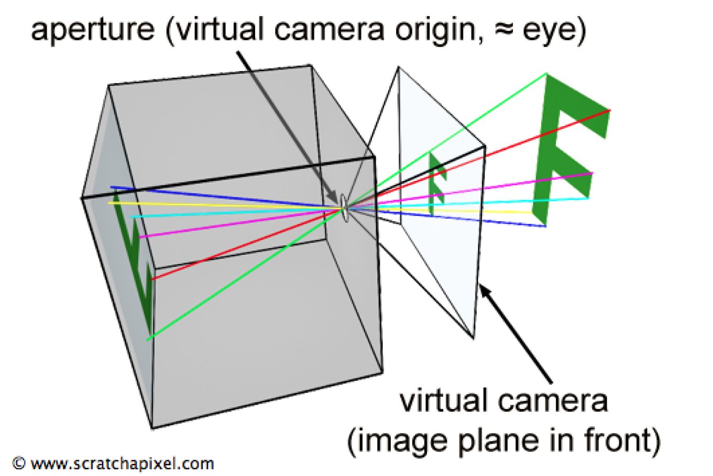
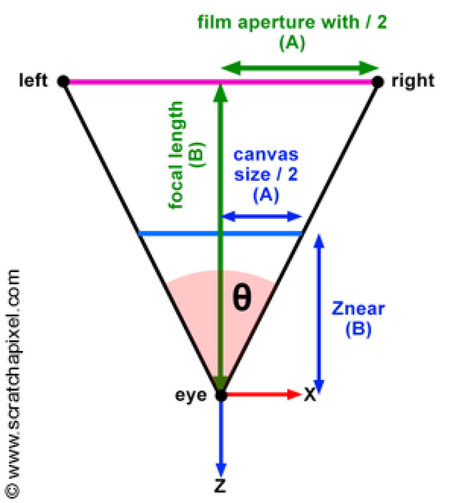
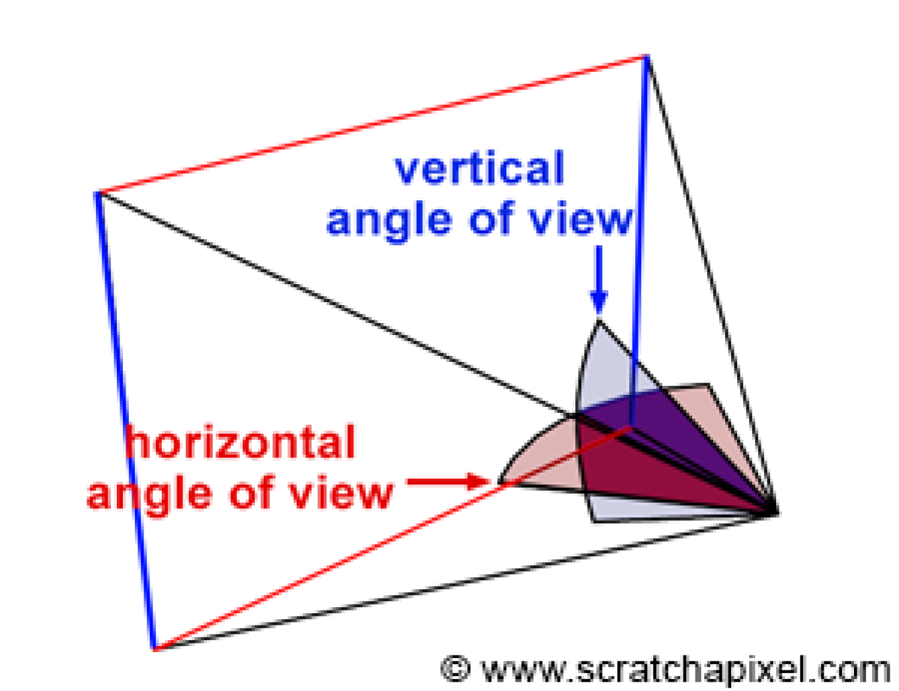
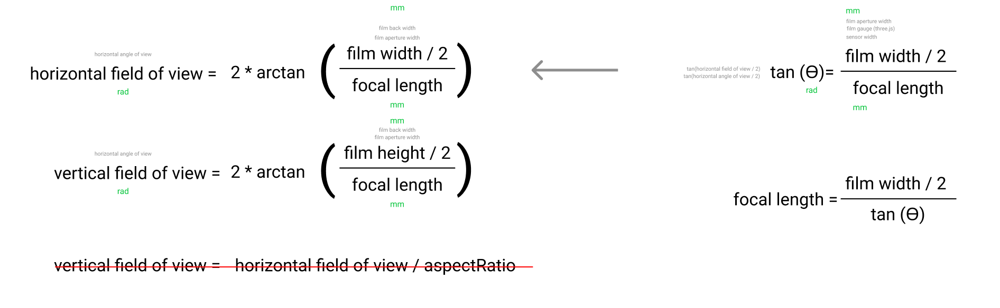
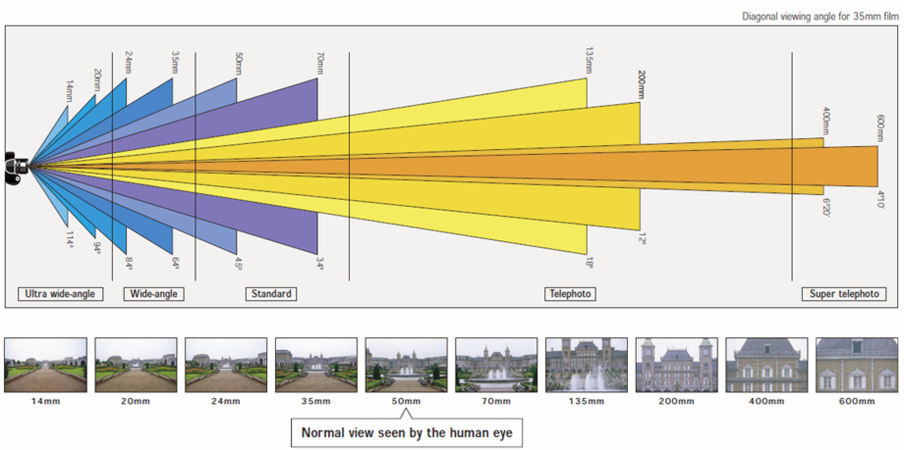
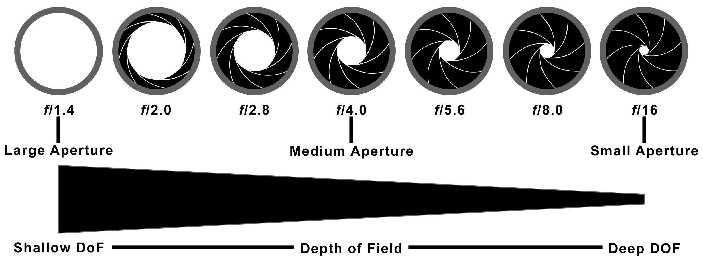
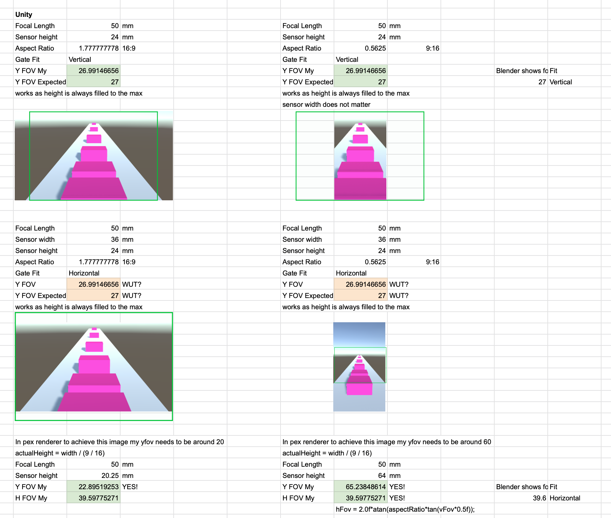
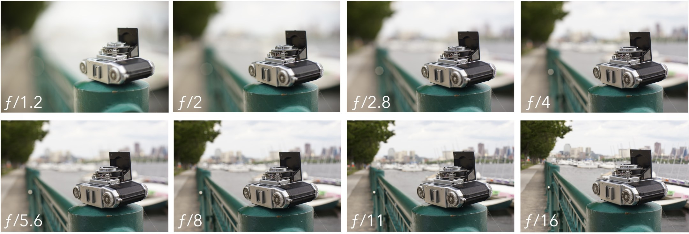
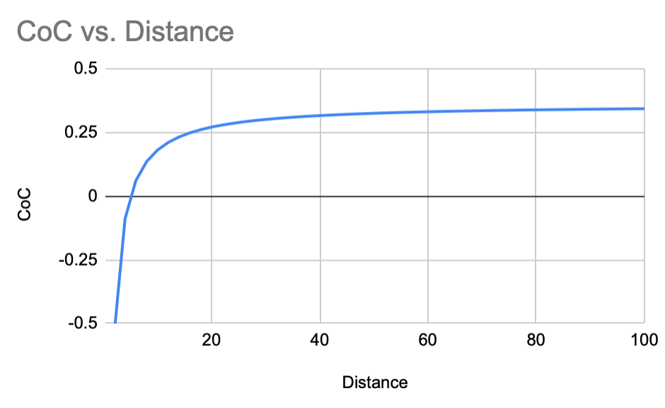

# Camera

# Based on virtual pinhole camera



# Focal Length



# Horizontal vs Vertical Field of View





# Focal Length & Fov



# F-stop (aperture)



# Sensor size and sensor fitting

vertical, horizontal, fill, overscan

Fitting 1920px x 1080px (16:9) render into full frame, 36mm x 24mm (4:3) sensor



# Depth of Field



## Circle of Confusion

- `c` - circle of confusion
- `S1, P` - distance to focus plane
- `S2, z` - distance to object
- `A` - aperture = f/N
- `f` - focal length
- `N` = fStop

```
//results in life of a bokeh formula
        S2 - S1     f      f    f      z - P     f^2    z - P
c = A * ------- * ------ = - * ----- * ----- =  ----- * -----
           S2     S1 - f   N   P - f     z      N * z   P - f


//results in what our shader is using
        S2 - S1     f      f    f      z - P
c = A * ------- * ------ = - * ----- * ----- =  ...
           S2     S1 - f   N   P - f     z

         f^2
... = ----------- * (1 - P / z) = MaxCoC * (1 - P / z)
      N * (P - f)

```

CoC based on Distance for focalLength=50mm, fStop=1.4, focusDistance=5m




# Appendix: Tables of (confusing) terms

Lens terms

| parameter                | alternative names    |
| ------------------------ | -------------------- |
| f-stop                   | f-number, aperture   |
| aperture diameter        | focalLength / f-stop |
| field of view            | angle of view        |
| horizontal field of view | xfov                 |
| vertical field of view   | yfov                 |

Sensor terms

| parameter   | alternative names            |
| ----------- | ---------------------------- |
| sensor size | film aperture, film size     |
| sensor fit  | film fit, gate fit           |
| 35mm film   | full frame, 36mm x 24mm film |

Depth of field terms

| parameter            | alternative names           |
| -------------------- | --------------------------- |
| depth of field       | range of the scene in focus |
| shallow DoF          | large blur                  |
| deep DoF             | small blur                  |
| circle of confussion | blur circle                 |
| focus distance       | focus plane                 |
